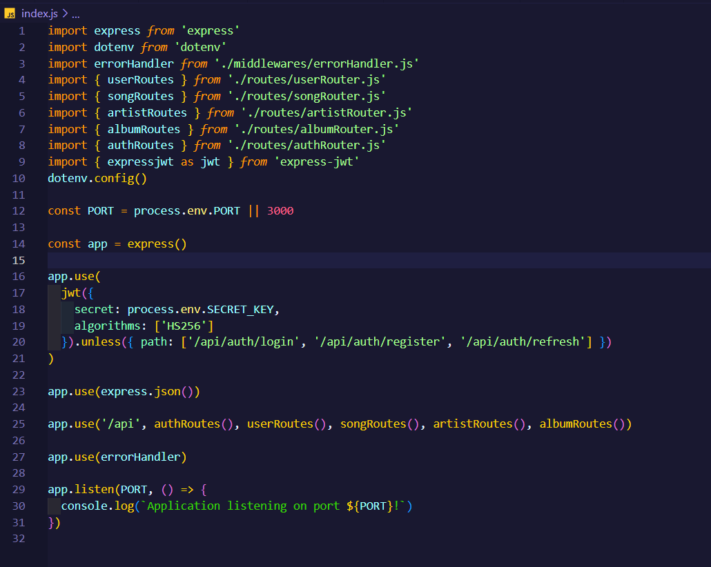
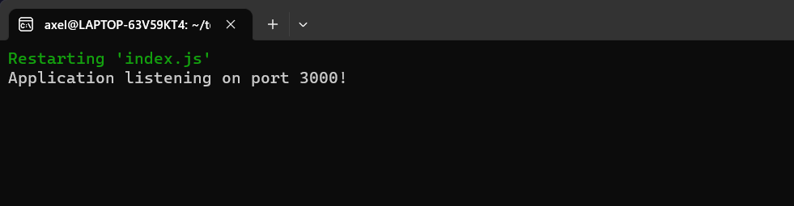
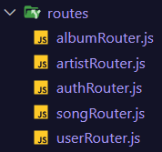
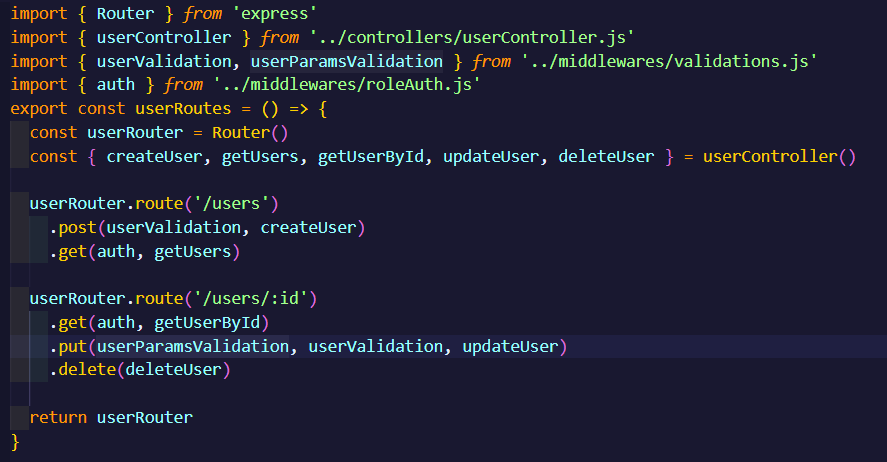
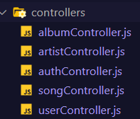
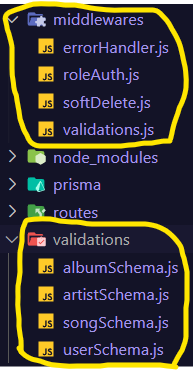
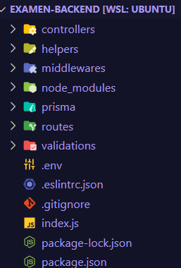

# My API

The goal of this project is to put my backend skills to the test when it comes to developing and implementing a complete CRUD for a music-oriented REST API, which has 4 models made with Prisma. These models are named: Songs, Users, Artists and Albums.

I was aboarding several topics while working on it, such as:

## How to create and run a server

## Routing - How to create and use routes

Example of a route:

## How to add functionality thanks to controllers:

## Middlewares and validations for extra layers of security:

These are the folders and files i've used for my project:

## Built with

- Bcrypt
- Dotenv
- NodeJS
- ESLint
- ExpressJS
- ExpressJWT
- Joi
- JSONWebToken
- NodeJS
- PostgreSQL
- Prisma

## Created by

[Axel Roitstein](https://github.com/axelroitstein)

