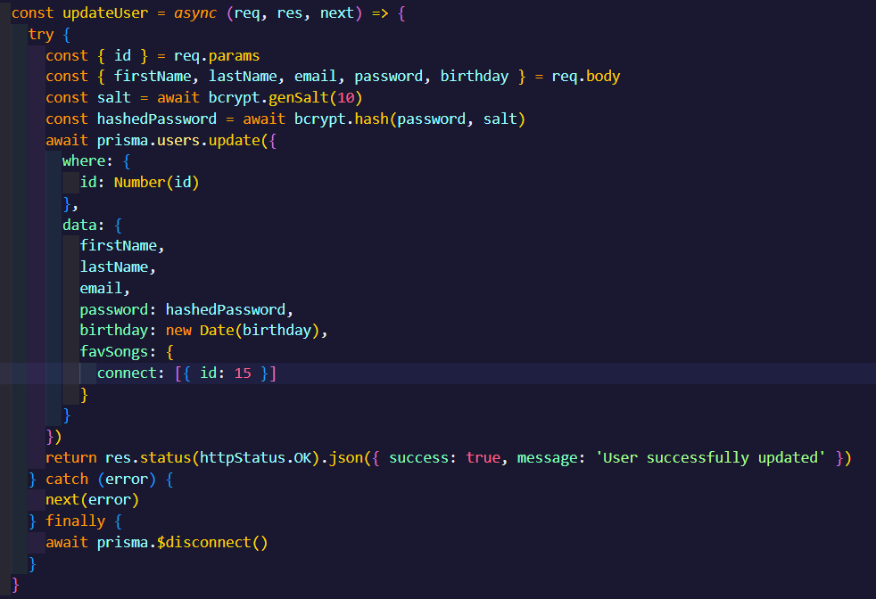
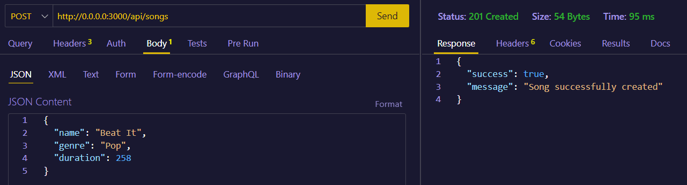

# My API

The goal of this project is to put my backend skills to the test when it comes to developing and implementing a complete CRUD for a music-oriented REST API, which has 4 models made with Prisma. These models are named: Songs, Users, Artists and Albums. In the following lines of this README.md, i will be providing the endpoints for creating, reading, updating and deleting data from the database. for all the requests, you need to login as an admin and use the token provided by the backend side. This token must be inserted into the header of the request as an authorization. Otherwise, you won't be able to access the resource. 

## Users (endpoint)

GET/POST ----> http://0.0.0.0:3000/api/users

You can use the /users endpoint to:

retrieve all the users in the database. You can see if the users have a song from the database marked as favorite

A user can also be registered within this endpoint:

## Auth/login (endpoint)

POST ----> http://0.0.0.0:3000/api/auth/login

The auth/login endpoint serves as an authentication step for the user to enter the app. You will be given a token and a refresh token in case the access token expires:

## Users/id (endpoint)

GET/PUT/DELETE ----> http://0.0.0.0:3000/api/users/{id}

You can use the /users/{id} endpoint to:

Get specific users according to the id sent as a parameter. You can see if the user has a song from the database marked as favorite:

Update a user information, whether is changing the name, genre, or duration. The user can also "mark a song as favorite" by connecting to an existing one in the database. 

Apply a soft delete to a user from the database:

## Songs (endpoint)

GET/POST ----> http://0.0.0.0:3000/api/songs

You can use the /songs endpoint to:

retrieve all the songs in the database. You can see from which album is the song and the users who marked it as a favorite.

A song can also be created within this endpoint. However, there must be an artist created before creating the song, as both songs and albums are linked to the artist. The id in the code corresponds to the artist who made the song and who is currently in the database. 

## Songs/id (endpoint)

GET/PUT/DELETE ----> http://0.0.0.0:3000/api/songs/{id}

You can use the /songs/{id} endpoint to:

Get specific songs according to the id sent as a parameter. You can see the albums where the song is included and the users that marked it as favorite:

Update a song, whether is changing the name, genre, or duration. You can also connect the song to an already existing album within the database.

Apply a soft delete to a song from the database:

## Artists (endpoint)

GET/POST ----> http://0.0.0.0:3000/api/artists

You can use the /artists endpoint to:

retrieve all the artists in the database. You can see the songs and the albums linked to each artist. 

You can also create an artist within this endpoint. Optionally, you can add the songs and albums from the artist in the query. To create only the artist, you can remove the queries that include the songs and albums.

## Artists/id (endpoint)

GET/PUT/DELETE ----> http://0.0.0.0:3000/api/artists/{id}

You can use the /artists/{id} endpoint to:

Get specific artists according to the id sent as a parameter. You can see the albums and songs associated with the artist

Update an artist, whether is adding new songs/albums or connecting the ones that already exist within the database, changing the name and/or nationality.

Apply a soft delete to an artist from the database:

## Albums (endpoint)

GET/POST ----> http://0.0.0.0:3000/api/albums

You can use the /albums endpoint to:

retrieve all the albums in the database. You can see the songs included in the album and the artist that made it.

An album can also be created within this endpoint. However, there must be an artist created before creating the album, as both songs and albums are linked to each artist. The id in the code corresponds to the artist who made the song and who is currently in the database. It also adds a song to the album.

## Albums/id (endpoint)

GET/PUT/DELETE ----> http://0.0.0.0:3000/api/albums/{id}

You can use the /albums/{id} endpoint to:

Get specific albums according to the id sent as a parameter. You can see the songs and artist related to the album.

Update an album, whether is adding new songs or connecting songs that already exist within the database, changing the name and/or release date.

Apply a soft delete to an album from the database:

These are the folders and files i've used for my project:

## Built with

- Bcrypt
- Dotenv
- NodeJS
- ESLint
- ExpressJS
- ExpressJWT
- Joi
- JSONWebToken
- NodeJS
- PostgreSQL
- Prisma

## Created by

[Axel Roitstein](https://github.com/axelroitstein)

